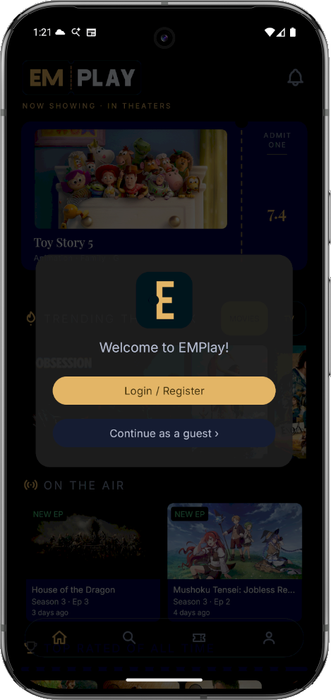
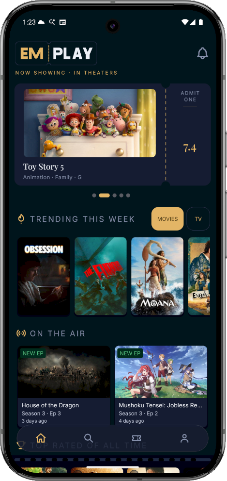
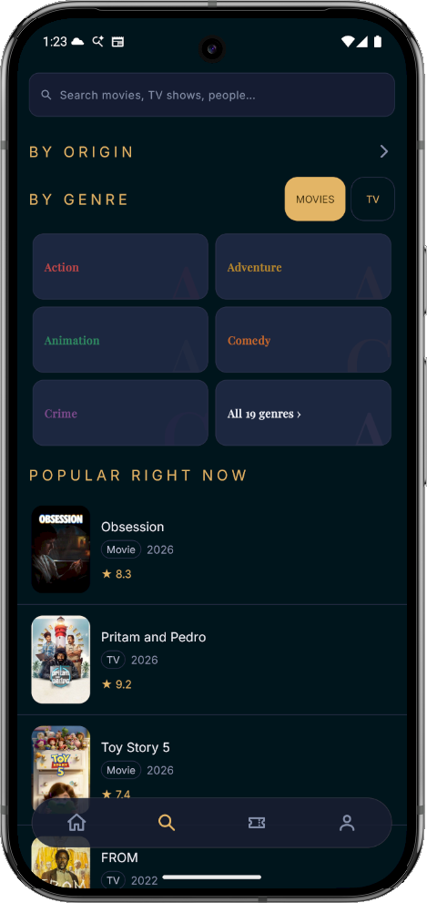
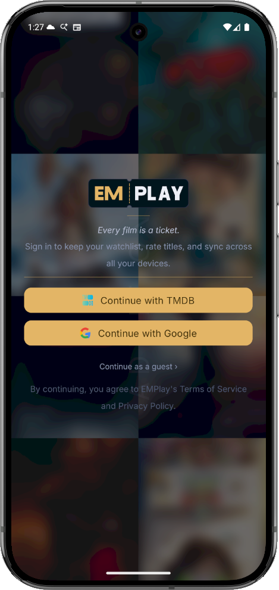
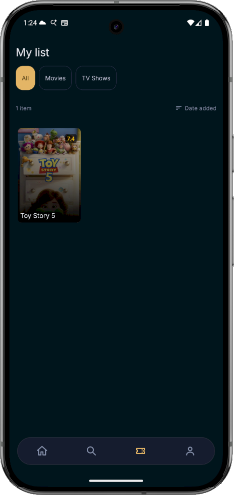
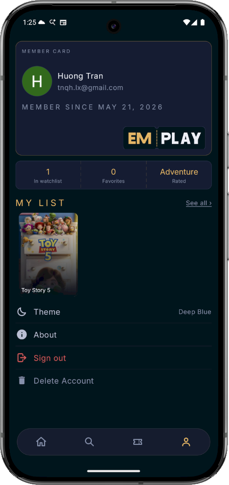

# EMPlay

An Android app for browsing movies and TV shows, using the TMDB API. Search titles, explore cast and crew, check where to stream, save favourites, and sync a watchlist with your TMDB account.

> This product uses the TMDB API but is not endorsed or certified by TMDB.

## Screenshots

| Welcome | Home | Search |
|:---:|:---:|:---:|
|  |  |  |
| **Login** | **My List** | **Profile** |
|  |  |  |

## Features

- **Home feed** — trending banner, top-rated, upcoming, on-air, and "What's New" rows with shimmer loading
- **Search** — multi-search across movies, TV shows, and people; toggle between tabs; trending suggestions
- **Detail pages** — overview, ratings, cast, trailers (in-app YouTube player), user reviews, and streaming providers (via Movie of the Night API)
- **TV show support** — season list, episode details, on-air shows
- **Genre & origin browsing** — filter by genre chip or country of origin
- **Cast pages** — biography, filmography, known-for grid
- **Liked items** — save movies/TV shows locally; swipe-to-delete from the profile tab
- **TMDB watchlist sync** — OAuth login to TMDB keeps your watchlist in sync across devices
- **Firebase auth** — email/password and Google Sign-In; profile cached in local SQLite
- **Release alerts** — bottom sheet showing upcoming releases from your watchlist

## Tech Stack

| Layer | Library |
|---|---|
| Language | Java 17 |
| Min / Target SDK | 23 / 36 |
| UI | Material 3, ConstraintLayout, RecyclerView, ViewPager, FlexboxLayout |
| Navigation | Fragment back-stack, BottomNavigationView |
| Networking | Retrofit 3 + OkHttp 5 |
| Image loading | Glide 4 |
| Auth | Firebase Auth, Google Sign-In, TMDB OAuth (Chrome Custom Tabs) |
| Local DB | SQLite (`DatabaseHelper`) |
| Remote DB | Firebase Realtime Database, Firestore |
| Streaming providers | Movie of the Night API (7-day SQLite cache) |
| Animations | DynamicAnimation, Facebook Shimmer |
| State | `SharedViewModel` (scoped to `MainActivity`) |

## Setup

### Prerequisites

- Android Studio Hedgehog or newer
- A [TMDB API key](https://www.themoviedb.org/settings/api) (free)
- A Firebase project with Authentication enabled (Email/Password + Google)

### 1. Clone the repo

```bash
git clone https://github.com/huongtran97/EMPlay.git
cd EMPlay
```

### 2. Configure `local.properties`

Create or edit `local.properties` in the project root (this file is git-ignored):

```properties
sdk.dir=/path/to/your/Android/Sdk
API_KEY=your_tmdb_v3_api_key
APP_TOKEN=your_tmdb_v4_read_access_token
GOOGLE_WEB_CLIENT_ID=your_google_web_client_id
```

### 3. Add Firebase config

Download `google-services.json` from your Firebase project console and place it at `app/google-services.json`.

### 4. Build and run

```bash
./gradlew assembleDebug
```

Or open the project in Android Studio and press **Run**.

## Build Commands

```bash
# Debug build
./gradlew assembleDebug

# Unit tests
./gradlew test

# Instrumented tests (requires connected device or emulator)
./gradlew connectedAndroidTest

# Lint
./gradlew lint

# Clean build
./gradlew clean assembleDebug
```

## Project Structure

```
app/src/main/java/emplay/entertainment/emplay/
├── activity/          # MainActivity, LoginActivity, SplashActivity, TMDBAuthActivity
├── adapter/           # RecyclerView adapters (movie/, tvshow/, common/)
├── api/               # Retrofit services and response models (common/, auth/, tvshow/)
├── auth/              # AuthManager — wraps Firebase + TMDB session logic
├── database/          # DatabaseHelper (SQLite), WatchlistHelper
├── fragment/
│   ├── common/        # Base fragments, SeeAll, WhatsNew, RecentlyAdded
│   ├── details/       # Movie/TV details, CastDetail, SeasonDetail, TrailerBottomSheet
│   ├── genre/         # Genre filter, OriginResults, AllGenres
│   └── layout/        # HomeFragment, SearchMovies/TV, ProfileFragment, WatchlistFragment
├── models/            # Data models (common/, movie/, tvshow/)
└── tool/              # Utilities: pagination, Glide transforms, UI helpers, MotnHelper
```

## API Notes

All TMDB calls go through a Railway proxy by default. To call TMDB directly, set `USE_PROXY = false` in `ApiClient.java`. The `TMDBInterceptor` rewrites requests and appends the API key transparently.

Always use `TMDBpath` to build TMDB path strings — don't hardcode paths in fragments.

## License

Copyright 2025 huongtran97. Licensed under the [Apache License 2.0](LICENSE).